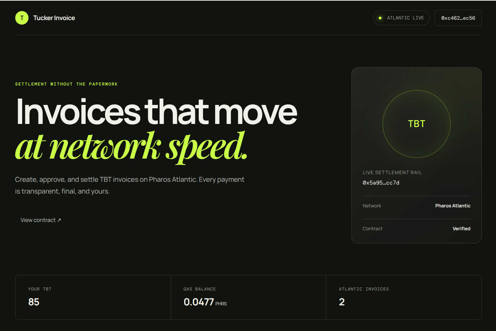
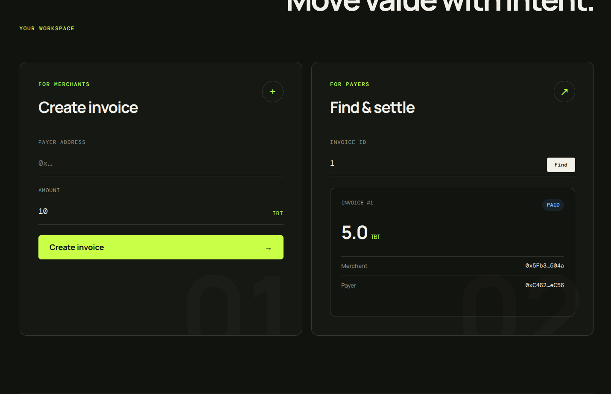
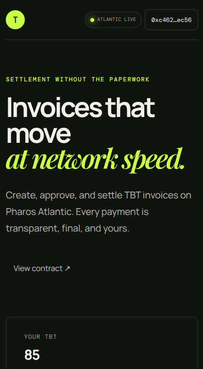

# Tucker Invoice

Tucker Invoice is a token-based invoicing dApp running on Pharos Atlantic Testnet. A merchant creates an invoice for a payer, the payer approves the exact TBT amount, and `InvoiceManager` settles the payment atomically.

> Testnet software only. PHRS and TBT used here have no guaranteed monetary value, and testnet participation does not guarantee an airdrop.



## What is deployed

| Contract | Address | Status |
| --- | --- | --- |
| TuckerBuilderToken (TBT) | [`0x326b07d3e36c1Aa6213368E5e1AaDa29f2CB4BE5`](https://atlantic.pharosscan.xyz/address/0x326b07d3e36c1Aa6213368E5e1AaDa29f2CB4BE5) | Verified |
| InvoiceManager | [`0x5a95783b6f19841E79c4Bb506981310661a4cc7d`](https://atlantic.pharosscan.xyz/address/0x5a95783b6f19841E79c4Bb506981310661a4cc7d) | Verified |

Network configuration:

| Setting | Value |
| --- | --- |
| Network | Pharos Atlantic Testnet |
| Chain ID | `688689` |
| RPC environment variable | `PHAROS_RPC_URL` |
| Explorer | [atlantic.pharosscan.xyz](https://atlantic.pharosscan.xyz/) |

Deployment details and transaction hashes live in [`deployments/`](deployments/). Existing deployment records are preserved separately from Foundry's generated broadcast artifacts.

## Product flow

```text
Merchant creates invoice
        ↓
Payer reviews amount and parties
        ↓
Payer approves the exact TBT amount
        ↓
Payer pays the invoice
        ↓
TBT moves to merchant and invoice becomes Paid
```

The payment path uses OpenZeppelin `SafeERC20.safeTransferFrom`. If the ERC-20 call reverts or returns `false`, the entire transaction reverts and the invoice remains `Open`. Setting the status before the external token call also prevents reentrant double payment.

## Repository structure

```text
.
├── src/                         Solidity contracts
├── test/                        Foundry unit and integration tests
├── script/                      Foundry deployment scripts
├── deployments/                 Human-readable Atlantic deployment records
├── broadcast/                   Foundry-generated transaction records
├── assets/screenshots/          README and project presentation images
└── frontend/                    Vite + React + ethers web application
```

## Smart contracts

### TuckerBuilderToken

- ERC-20 name: `Tucker Builder Token`
- Symbol: `TBT`
- Decimals: `18`
- Initial supply: `1,000,000 TBT`
- Initial holder: deployer

### InvoiceManager

- Rejects zero payer addresses and zero amounts.
- Only the configured payer can settle an invoice.
- Rejects nonexistent and already-paid invoices.
- Uses exact invoice amounts and `SafeERC20` settlement.
- Emits `InvoiceCreated` and `InvoicePaid` events.

## Prerequisites

- [Foundry](https://book.getfoundry.sh/getting-started/installation)
- Node.js 20 or newer
- MetaMask or another EIP-1193 wallet
- Testnet PHRS for gas

Clone with submodules:

```bash
git clone --recurse-submodules <repository-url>
cd hello-foundry
```

If the repository was cloned without submodules:

```bash
git submodule update --init --recursive
```

## Contract development

Copy the non-secret environment template and supply the Atlantic RPC:

```bash
cp .env.example .env
```

Never put private keys, seed phrases, keystore passwords, or wallet secrets in `.env`.

Run all Solidity checks:

```bash
forge fmt --check
forge build
forge lint
forge test
```

Current validated result: **17 tests passed, 0 failed** with Solidity `0.8.35`.

## Frontend development

```bash
cd frontend
cp .env.example .env
npm install
npm run dev
```

Open [http://localhost:5173](http://localhost:5173). The frontend supports:

- MetaMask connection and account changes.
- Adding or switching to Pharos Atlantic.
- TBT and PHRS account balances.
- Invoice creation and lookup.
- Exact-amount TBT approval.
- Invoice settlement and explorer links.
- Wrong-network transaction gating.
- Responsive desktop, tablet, and mobile layouts.

### Interface

The desktop workspace keeps invoice creation and settlement side by side. A paid invoice shows its final on-chain status without exposing further approval or payment actions.



The wallet, network, and account overview remain visible in the compact mobile layout.

<p align="center">
  
</p>

Build the production bundle:

```bash
npm run build
```

## Deploying InvoiceManager

The deployment script reads the existing token address from `TBT_ADDRESS` and contains no wallet secret.

Dry-run only:

```bash
set -a
source .env
set +a

forge script script/DeployInvoiceManager.s.sol:DeployInvoiceManager \
  --rpc-url "$PHAROS_RPC_URL" \
  -vvvv
```

Human-approved broadcast using the local Foundry keystore:

```bash
forge script script/DeployInvoiceManager.s.sol:DeployInvoiceManager \
  --rpc-url "$PHAROS_RPC_URL" \
  --account pharos-builder \
  --broadcast \
  -vvvv
```

Always dry-run, confirm chain ID `688689`, verify the constructor address, and review the gas estimate before broadcasting.

## Security notes

- Never commit `.env`, keystores, passwords, seed phrases, or private keys.
- Use dedicated testnet accounts rather than wallets holding mainnet assets.
- Review the selected account, chain, contract, amount, and function in MetaMask before signing.
- The frontend approves only the current invoice amount instead of unlimited allowance.
- A verified contract is not the same as a third-party security audit.

## License

Solidity source files are licensed under MIT where indicated.
